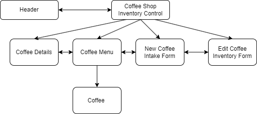

#  Coffee Shop Inventory

#### By: Jason Elijah Church

#### A web application created in React to control coffee inventory.

## Technologies Used
* React
* Git Bash
* Visual Code Studio
* JavaScript
* CSS
* HTML
* JSX

## Description:

This is a diagram of the components used in this application:

This application lists the current coffee menu and inventory with a pre-built state of coffee objects in an array. The viewer is directed to this coffee menu, with the CoffeeMenu component automatically rendering upon start, and from there can either add another coffee inventory item to the menu or either view details or "sell" inventory (by reducing inventory by 1 lb) from a specific coffee inventory item. Switching between components is handled by local state and toggling its various properties from false, true, or to a specific selected coffee item. 

## Setup/ Installation Requirements

1. Clone this repository to your desktop.
2. In the topmost directory of the project, open up all of the code using Visual Code Studio or a similar application to view the written code.
3. If you have Node Package Manager installed on your computer and are running v16.13.1, you can enter npm install in the topmost directory of the project to install all the listed plug-ins in the package.json.
4. From there the webpage itself can be viewed by entering npm start in your console to open up a local live server.

## Known Bugs
Currently no known bugs. 

## License

MIT License

Copyright (c) (2023) Jason Elijah Church

Permission is hereby granted, free of charge, to any person obtaining a copy
of this software and associated documentation files (the "Software"), to deal
in the Software without restriction, including without limitation the rights
to use, copy, modify, merge, publish, distribute, sublicense, and/or sell
copies of the Software, and to permit persons to whom the Software is
furnished to do so, subject to the following conditions:

The above copyright notice and this permission notice shall be included in all
copies or substantial portions of the Software.

THE SOFTWARE IS PROVIDED "AS IS", WITHOUT WARRANTY OF ANY KIND, EXPRESS OR
IMPLIED, INCLUDING BUT NOT LIMITED TO THE WARRANTIES OF MERCHANTABILITY,
FITNESS FOR A PARTICULAR PURPOSE AND NONINFRINGEMENT. IN NO EVENT SHALL THE
AUTHORS OR COPYRIGHT HOLDERS BE LIABLE FOR ANY CLAIM, DAMAGES OR OTHER
LIABILITY, WHETHER IN AN ACTION OF CONTRACT, TORT OR OTHERWISE, ARISING FROM,
OUT OF OR IN CONNECTION WITH THE SOFTWARE OR THE USE OR OTHER DEALINGS IN THE
SOFTWARE.